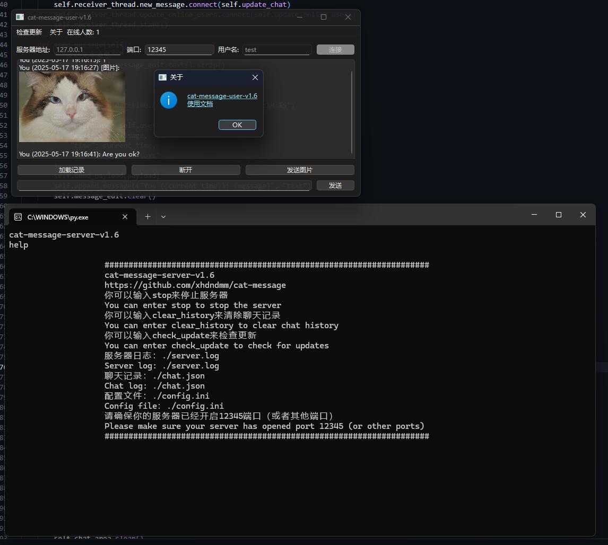

# cat-message项目使用文档
## 1. 项目介绍
本项目是一个基于socket的即时通讯软件，使用Python编写。它支持多用户聊天、聊天信息传输加密等功能。项目分为客户端和服务器端两部分，客户端使用PyQt6进行界面设计，服务器端使用socket库进行网络通信。产品界面简洁功能齐全，可进行简易通讯。
## 2. 项目结构
项目结构如下：
```
docs
├── 001.png
├── docs.md
├── index.html
src
├── server.py
├── user.py
.gitignore
LICENSE
README.md
requirements.txt
```
注：src目录下是项目的源代码，docs目录下是项目的使用文档。README.md文件是项目的说明文件，LICENSE文件是项目的许可证文件requirements.txt文件是项目的依赖库文件。  
**main分支为稳定版本，dev分支为开发版本。**
## 3. 开发环境要求
- Python 3.X（我使用Python 3.12.8开发 低版本也能用）
- PyQt6（用于客户端界面设计）
- git（用于版本控制）
## 4. 使用说明
### 4.1 基础使用
如果你是windows用户，你可以在[这里](https://github.com/xhdndmm/cat-message/releases)下载最新版本的exe文件，下载后直接运行exe文件即可。  
如果你是其他系统用户，请阅读下方源码部署部分。
### 4.2 源码部署
首先克隆存储库：
```
git clone https://github.com/xhdndmm/cat-message.git
cd cat-message/
```
* 注：如需要指定版本请在[这里](https://github.com/xhdndmm/cat-message/releases)下载源码  

**重要：从1.3版本开始 服务端版本和客户端版本必须一样，不然无法使用！**
然后安装依赖
```
pip install -r requirements.txt
```
运行源代码
```
cd src/
#服务端
python3 server.py
#客户端
python3 user.py
```
### 4.3 服务端进程守护
如果你在Linux下需要守护进程，建议使用MCSM面板，方便操作。
### 4.4 界面
#### 4.4.1 服务端界面
服务端并没有设计图形化界面，在命令行内操作。目前有stop命令（关闭服务），clear_history命令（清除聊天记录）, help命令（帮助）还有check_update（检查更新）可以输入。使用时会在所在目录创建server.log文件（日志）和chat.json文件（聊天记录）。使用时请确保12345端口（默认端口为12345 也可以自定义）为开放状态
#### 4.4.2 客户端界面
  
* 图为v1.5测试版本的截图  

使用时请在服务器地址输入框填写服务器IP/域名，在用户名输入框填写用户名，在端口输入框填写端口，然后点击连接按钮连接服务器。若服务器不能正确连接，会提示。默认不加载聊天记录，需要手动点击加载聊天记录按钮来加载聊天记录。使用完毕可以点击断开连接来断开与服务器的连接
#### 4.4.3 自定义
你可以自己在config.ini修改端口（此文件自动创建，默认为12345端口）
### 4.5 问题反馈
程序不可避免会出现BUG，如果你发现有些问题，可以在[这里](https://github.com/xhdndmm/cat-message/issues)反馈。
### 4.6 协议
请遵守[GPL-3.0](https://www.gnu.org/licenses/gpl-3.0.html)协议